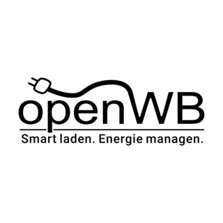

# ioBroker.openwb2

[](https://www.npmjs.com/package/iobroker.openwb2)
[](https://www.npmjs.com/package/iobroker.openwb2)


[](https://nodei.co/npm/iobroker.openwb2/)

**Tests:** 

## openwb2 adapter for ioBroker

Reads chargepoints, counters, battery, PV and consumers from an [openWB](https://openwb.de) 2 wallbox
controller live over MQTT, and lets you control charging via its `simpleAPI` HTTP interface, from ioBroker.

> **Disclaimer:** this is an independent, community-maintained adapter. It is not affiliated with, endorsed
> by, or supported by openWB GmbH & Co. KG. "openWB" is a trademark of its respective owner; the adapter
> icon is openWB's own official logo, used with permission from openWB.

### Reads via MQTT, writes via HTTP

This adapter reads live data from openWB's MQTT broker (`openWB/simpleAPI/#`) and sends control commands via
its `simpleAPI` HTTP interface (`simpleapi.php`). Both need to be reachable from your ioBroker host.

### Requirements

- openWB 2.3 or later - `simpleAPI` is always active on these versions, nothing to enable.

### Configuration

The admin UI has two tabs:

- **Connection** - one shared **Host / IP address** field for both the HTTP and MQTT connection (the same
  device in a normal setup). **Test connection** checks both and reports each separately. **Advanced** holds
  HTTP/MQTT ports, timeouts and authentication - only relevant if you've customized openWB's own config
  files directly.
- **Components** - the device discovery table. **Probe now** adds newly seen chargepoints, counters,
  batteries, PV modules and consumers as new rows, disabled by default - tick a row and Save to activate it
  and create its objects. Give a row a **Name** to label it in the object tree (openWB only reports a name
  over MQTT for chargepoints). Untick or remove a row you don't want; a row no longer observed is flagged,
  not deleted. You can also add an ID by hand. **New-device check interval** repeats discovery in the
  background (off by default). **Energy values shown as** switches every cumulative energy counter
  instance-wide between `Wh` (default) and `kWh`.

### Object structure

```
openwb2.0.info.connection                  boolean, true while connected to the MQTT broker
openwb2.0.chargepoint.<id>.<field>          read-only: power, voltages/currents/powers per phase, soc,
                                             state_str, plug_state, charge_state, rfid, configName, ...
openwb2.0.chargepoint.<id>.control.<field>  writable: chargemode, chargepointLock, maxPriceEco,
                                             instantChargingCurrent/Limit/Amount/Soc,
                                             pvChargingLimit/Amount/Soc/MinCurrent/MinSoc, vehicle
openwb2.0.counter.<id>.<field>              read-only
openwb2.0.battery.<id>.<field>              read-only
openwb2.0.battery.<id>.control.batMode           writable enum: min_soc_bat_mode / ev_mode / bat_mode
openwb2.0.battery.<id>.control.batPowerReserve   writable number, W
openwb2.0.pv.<id>.<field>                   read-only
openwb2.0.consumer.<id>.<field>             read-only
openwb2.0.pv.total.<field>                  read-only: power, exported, monthlyExported, yearlyExported -
                                             system-wide sum across all enabled PV modules
openwb2.0.chargepoint.total.<field>         read-only: power, imported, exported - system-wide sum across
                                             all enabled chargepoints
openwb2.0.counter.homeConsumption.<field>   read-only: power, dailyConsumption, totalConsumption,
                                             excludedPower, disengageableSmarthomePower, invalidReadings -
                                             openWB's own estimated whole-house consumption (not a physical
                                             meter); always created, stays null if openWB isn't computing this
```

Read-only values and writable controls live in separate channels (`chargepoint.<id>.*` vs.
`chargepoint.<id>.control.*`). `batMode`/`batPowerReserve` live under each battery's own `control` channel,
though the underlying setting is global across all batteries.

Energy counters (`imported`/`exported` and their `daily_`/`monthly_`/`yearly_` variants) are in **Wh** by
default; switch to `kWh` in the Components tab.

Most chargepoint control states also show the real, device-confirmed value, not just an echo of what was
last written.

### Known limitations

- Component discovery only adds rows, always disabled - it never activates or deletes anything on its own.
- The MQTT broker connection has no TLS option in the admin UI yet - only plain `mqtt://`.

## Developer manual

This section is intended for the developer.

### Scripts in `package.json`

| Script name        | Description                                                                                                            |
| ------------------ | ---------------------------------------------------------------------------------------------------------------------- |
| `build`            | Compile the TypeScript backend and the React admin UI.                                                                 |
| `watch`            | Same, but watching for changes.                                                                                        |
| `test:ts`          | Executes the unit tests in `src/**/*.test.ts`.                                                                         |
| `test:package`     | Ensures `package.json` and `io-package.json` are valid.                                                                |
| `test:integration` | Tests the adapter startup with an actual instance of ioBroker.                                                         |
| `test`             | Runs `test:ts` and `test:package`.                                                                                     |
| `check`            | Type-checks both the backend and the admin UI without compiling.                                                       |
| `lint`             | Runs ESLint.                                                                                                           |
| `translate`        | Translates admin UI texts, see [`@iobroker/adapter-dev`](https://github.com/ioBroker/adapter-dev#manage-translations). |

### Test the adapter manually with dev-server

```bash
dev-server watch
```

The ioBroker.admin interface will then be available at http://localhost:8083/. See the
[`dev-server` documentation](https://github.com/ioBroker/dev-server#command-line) for more details.

### Publishing the adapter

Releases publish to npm automatically via GitHub Actions when a `v<major>.<minor>.<patch>` tag is pushed -
see `.github/workflows/test-and-release.yml`. To get the adapter listed in the ioBroker repository, see
[ioBroker.repositories](https://github.com/ioBroker/ioBroker.repositories#requirements-for-adapter-to-get-added-to-the-latest-repository).

## Changelog

<!--
    Placeholder for the next version (at the beginning of the line):
    ### **WORK IN PROGRESS**
-->

### 0.3.3 (2026-10-02)

- (SeaSpotter) Fixed `chargepoint`/`counter`/`battery`/`pv` missing their parent folder object -
  each `<type>.<id>` channel was an orphan with no `<type>` object above it.
- (SeaSpotter) Fixed `batPowerReserve`/`instantChargingAmount`/`pvChargingAmount` using roles not in
  the ioBroker role catalogue (`level.power`/`level.energy` -> `level`).
- (SeaSpotter) Fixed `consumer.<id>.chargeState` reading empty - the real device publishes it as
  `get/state`, not `get/charge_state`. Removed `consumer.<id>.phasesInUse`, confirmed live against a
  real consumer module to have no live equivalent.

### 0.3.2 (2026-10-02)

- (SeaSpotter) Fixed the admin UI's "Test connection" MQTT probe leaking a bare, untracked timer.
- (SeaSpotter) Various packaging/CI fixes for ioBroker repository compliance (dependency versions,
  workflow ordering, Dependabot cooldown and automerge for patch/minor updates).

### 0.3.1 (2026-10-02)

- (SeaSpotter) Fixed `chargepoint.<id>.control`/`battery.<id>.control` channel names never
  updating on an existing installation.

### 0.3.0 (2026-10-02)

- (SeaSpotter) Migrated the admin UI to `@iobroker/gui-components` (React 19, MUI 9).

Older versions are listed in [CHANGELOG_OLD.md](CHANGELOG_OLD.md).

## License

MIT License

Copyright (c) 2026 SeaSpotter <seatowage@gmail.com>

Permission is hereby granted, free of charge, to any person obtaining a copy
of this software and associated documentation files (the "Software"), to deal
in the Software without restriction, including without limitation the rights
to use, copy, modify, merge, publish, distribute, sublicense, and/or sell
copies of the Software, and to permit persons to whom the Software is
furnished to do so, subject to the following conditions:

The above copyright notice and this permission notice shall be included in all
copies or substantial portions of the Software.

THE SOFTWARE IS PROVIDED "AS IS", WITHOUT WARRANTY OF ANY KIND, EXPRESS OR
IMPLIED, INCLUDING BUT NOT LIMITED TO THE WARRANTIES OF MERCHANTABILITY,
FITNESS FOR A PARTICULAR PURPOSE AND NONINFRINGEMENT. IN NO EVENT SHALL THE
AUTHORS OR COPYRIGHT HOLDERS BE LIABLE FOR ANY CLAIM, DAMAGES OR OTHER
LIABILITY, WHETHER IN AN ACTION OF CONTRACT, TORT OR OTHERWISE, ARISING FROM,
OUT OF OR IN CONNECTION WITH THE SOFTWARE OR THE USE OR OTHER DEALINGS IN THE
SOFTWARE.
